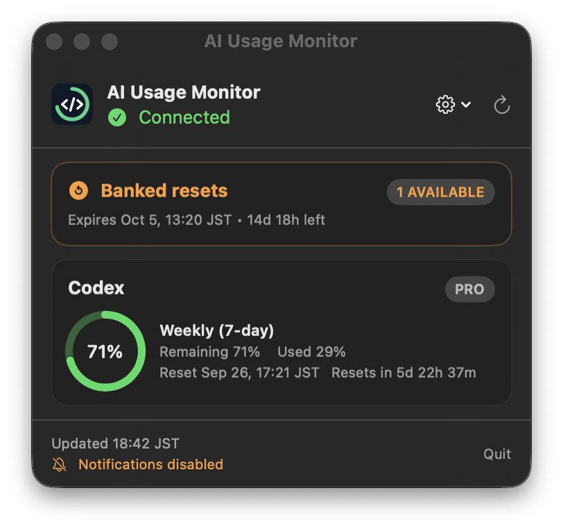
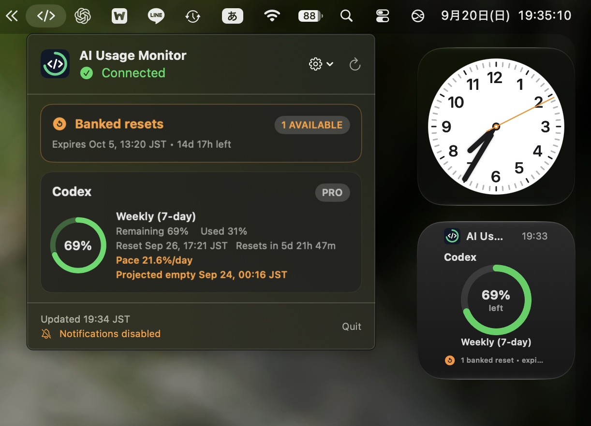

# AI Usage Monitor

AI Usage Monitorは、ローカルにインストールされたCodexの`app-server`が返す
利用上限を表示する、独立したmacOSメニューバーアプリ兼デスクトップウィジェットです。
利用者自身が内容を確認し、自分のMacでビルド、署名、インストールできるよう、
ソースコードとして公開しています。

<p align="center">
  
</p>

<p align="center">
  
  <br>
  <sub>メニューバー画面とデスクトップウィジェットを並べた表示例</sub>
</p>

## Codexでインストール（推奨）

> **おすすめ**
>
> 下のプロンプトをCodexへ貼り付けると、ソースの取得、テスト、ビルド、
> アプリの配置、ウィジェットの確認まで任せられます。

1. このGitHubリポジトリのHTTPS URLをコピーします。
2. インストール先のMacでChatGPTデスクトップアプリを開き、Codexの
   [ローカル環境](https://developers.openai.com/ja-JP/docs/environments/local-environment)
   で新しいタスクを開始します。クラウド環境や別のMac上のタスクでは、対象Macへ
   アプリを配置したりウィジェットを登録したりできません。
3. 次のプロンプト全体をそのままCodexへ送ります。

```text
以下のGitHubリポジトリから AI Usage Monitor を、このMacへインストールしてください。

リポジトリURL: https://github.com/TikTak007/ai-usage-monitor-macos-widget

説明や手順の提示だけで終わらず、安全を確認しながらローカルMacへの導入完了まで進めてください。

1. 最初にリポジトリの README.md、SECURITY.md、scripts/build_app.sh を読み、記載内容と実行する処理を確認してください。
2. macOS 13以降であることと、git、xcodebuild、swift、Codexの app-server が利用できることを確認してください。不足があれば勝手に別のソフトを導入せず、そこで止めて必要事項を報告してください。
3. ソースは ~/Developer/AIUsageMonitor に配置してください。存在しなければクローンし、すでに存在する場合は同じリポジトリか、未保存の変更がないかを確認してください。別のフォルダの上書き、`reset`、`stash`、既存変更の破棄はしないでください。
4. ~/.codex/auth.json を含む認証情報やトークンのファイルは、開く、読み取る、表示する、コピーする、変更する、のいずれも行わないでください。sudoの使用、Gatekeeperの無効化、macOSのセキュリティ設定の緩和も行わないでください。
5. `python3 -m unittest discover -s tests` と `swift test` を実行してください。失敗を隠したりスキップしたりせず、失敗した場合はインストールを止め、原因と次の対応を報告してください。
6. このMacのキーチェーンに既存の Apple Development 署名IDが利用可能か、秘密情報を表示せずに確認してください。利用できる場合はそのIDを CODE_SIGN_IDENTITY に指定し、利用できない場合は scripts/build_app.sh のアドホック署名を使用してください。後者ではアプリは動作しても、macOSがウィジェットを検出しない場合があることを報告してください。
7. scripts/build_app.sh でリリース版をビルドし、生成されたアプリ本体と内蔵ウィジェットの署名、およびバンドル識別子を検証してください。
8. 生成された「AI Usage Monitor.app」を ~/Applications へ配置してください。既存版がある場合は、このアプリだけを終了し、日時入りのバックアップを作ってから置き換えてください。他のアプリやファイルには変更を加えないでください。
9. アプリを一度起動し、メニューバー項目が起動することを確認してください。macOSがウィジェットをまだ検出していない場合に限り、内蔵されたAI Usage Monitorのウィジェット拡張だけを再登録または再認識させてください。
10. 最後に、ソースの配置先、アプリの配置先、テスト結果、署名方式、メニューバーアプリとウィジェットの確認結果、残っている手動操作を日本語で報告してください。ウィジェットが利用可能なら「デスクトップを右クリック → ウィジェットを編集 → AI Usage Monitorを検索 → サイズを選んで追加」の手順も案内してください。

作業はこのMac内だけで完結させてください。フォーク、プッシュ、公開、リリース作成、外部サービスへの診断情報送信は行わないでください。
```

> **重要**
>
> AI Usage Monitorは非公式のコミュニティプロジェクトです。OpenAIとの提携、
> OpenAIによる支援・承認を受けたものではありません。Codex、ChatGPT、OpenAIは
> OpenAIの商標です。このリポジトリには、OpenAIのロゴや公式製品アイコンを
> 含めていません。

「AI Usage Monitor」は一般的な説明名称であり、独占的なブランドを主張するものでは
ありません。同名または類似名称のプロジェクトと比較する場合は、このリポジトリの
URLで識別してください。

## 主な機能

- ローカルのCodex `app-server`が返す、すべての利用枠を表示します。
- 残量、使用率、リセット時刻、リセットまでのカウントダウンを表示します。
- 利用可能なすべてのバンクリセットと、判明している各有効期限を表示します。
- リセットの影響を受けにくい軽量な移動計算で、利用ペースを推定します。
- WidgetKitによる小・中サイズのデスクトップウィジェットを提供します。
- 「システム連動」「ライト」「ダーク」の表示モードを選択できます。
- 3分ごとの自動更新と、手動更新に対応します。
- 使用率が新たに10%の境界を越えたとき、任意で通知します。
- 更新に失敗しても、最後に取得できた正常な情報を表示し続けます。

AI Usage Monitorがバンクリセットを使用したり、利用上限の回避・変更を試みたりする
ことはありません。

## 動作要件

- macOS 13以降
- macOSプラットフォームを導入済みのXcode
- GitおよびSwift（Xcodeに含まれます）
- Codexデスクトップアプリ、互換性のあるCodex実行ファイルを含むChatGPT
  デスクトップアプリ、または`app-server`に対応した`codex`実行ファイル
- Codexによって管理されている既存のChatGPTログイン

APIキーは不要です。AI Usage Monitorは`~/.codex/auth.json`を読み取らず、
アクセストークンも受け取りません。

## 手動でのビルドとインストール

```sh
git clone https://github.com/TikTak007/ai-usage-monitor-macos-widget AIUsageMonitor
cd AIUsageMonitor
python3 -m unittest discover -s tests
swift test
scripts/build_app.sh
mkdir -p "$HOME/Applications"
/usr/bin/ditto "dist/AI Usage Monitor.app" "$HOME/Applications/AI Usage Monitor.app"
open "$HOME/Applications/AI Usage Monitor.app"
```

標準のビルドではローカルのアドホック署名を使用します。メニューバーアプリの実行には
十分ですが、macOSがアドホック署名されたWidgetKit拡張を一覧へ表示しない場合が
あります。Apple Development証明書をお持ちの場合は、キーチェーン上の正確な名前を
指定して再ビルドしてください。

```sh
CODE_SIGN_IDENTITY="Apple Development: あなたの名前 (TEAMID)" scripts/build_app.sh
```

インストール済みアプリを置き換え、一度起動します。デスクトップウィジェットを追加する
には、デスクトップを右クリックして**ウィジェットを編集**を選び、
**AI Usage Monitor**を検索して、小または中サイズのウィジェットを追加します。

## 更新

ソースディレクトリで次を実行します。

```sh
git pull --ff-only
python3 -m unittest discover -s tests
swift test
scripts/build_app.sh
```

AI Usage Monitorを終了します。元へ戻せるようにしたい場合はインストール済みアプリを
保存してから、`dist/AI Usage Monitor.app`で置き換えて再度起動します。

## アンインストール

AI Usage Monitorを終了し、`~/Applications/AI Usage Monitor.app`をゴミ箱へ
移動します。その後、デスクトップからウィジェットを取り除き、クローンしたソース
ディレクトリを削除できます。このアプリはデーモンや特権ヘルパーをインストールしません。

## 仕組み

```text
メニューバーUI -> ローカルCodex app-server -> 利用上限の応答
      |
      +-> 127.0.0.1上の正規化済みスナップショット -> WidgetKit拡張
```

ウィジェット連携は、IPv4のループバック（`127.0.0.1`）だけで待ち受けます。
利用枠名、割合、リセット時刻、バンクリセットの概要、接続状態、更新時刻を含む、
正規化済みスナップショットだけを共有します。アカウント情報、認証情報、
`app-server`の未加工応答は共有しません。

利用ペースの推定では、利用枠ごとに最大64件の小さなサンプルをローカルのユーザー設定へ
保存します。短時間の移動ペースと、時間で重み付けした長時間のペースを組み合わせます。
利用枠がリセットされた場合は負のペースを発生させず、単調増加する消費量へ反映します。
バックエンドによる小さな下方修正は消費として加算しません。十分な履歴がない場合や、
予測される使い切り時刻がリセット後になる場合は、推定値を表示しません。

## 診断

同梱のPython診断ツールは標準ライブラリだけを使用します。

```sh
python3 run_poc.py
python3 run_poc.py --json
python3 run_poc.py --describe-response
```

アカウントの未加工データや認証情報は意図的に除外しています。診断結果を確認せずに
公開しないでください。

## 開発

すべてのテストを実行します。

```sh
python3 -m unittest discover -s tests
swift test
```

アプリと内蔵ウィジェットをビルドします。

```sh
scripts/build_app.sh
```

`app-server`のプロトコルは、利用者がインストールしたCodex実行ファイルによって
提供され、このプロジェクトとは別に変更される可能性があります。未知の正の利用期間は、
5時間枠や週間枠へ強制的に分類せず、中立的な名称で表示します。

## プライバシーとセキュリティ

[PRIVACY.md](PRIVACY.md)と[SECURITY.md](SECURITY.md)も参照してください。
要点は次のとおりです。

- AI Usage Monitorは、アクセス解析、テレメトリー、広告、外部サービスを追加しません。
- 認証とトークン更新は、引き続きCodexが担当します。
- 認証情報を意図的に読み取り、コピー、記録、保存することはありません。
- ウィジェットはローカルのループバック経由で、正規化済みデータだけを受け取ります。
- アプリはバンクリセットを使用せず、アカウント設定も変更しません。

## 商標について

AI Usage Monitorは、一般的な説明名称と独自に作成したアイコンを使用しています。
Codex、ChatGPT、OpenAIへの言及は互換性を説明するためのものです。これらの名称と商標は
OpenAIに帰属します。最新の[OpenAIデザインガイドライン](https://openai.com/brand/)
も参照してください。

## ライセンス

ソースコードは[MITライセンス](LICENSE)で公開しています。第三者の製品名および商標は、
MITライセンスの対象には含まれません。
